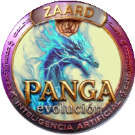

# 🐉 PANGA EVOLUTION: The Intelligent Utility Layer
> **"La convergencia definitiva entre la Inteligencia Artificial y la eficiencia On-Chain. No es solo un token, es el siguiente paso en la evolución de ZAARD INNOVATION."**

## 🌌 Visión General y Propósito
**PANGA EVOLUTION ($PANGA)** nace como la respuesta técnica a la necesidad de un activo de alta velocidad y utilidad real dentro del ecosistema **ZAARD**. Mientras que ZAARD se consolida como el pilar de reserva de valor y ahorro a largo plazo, **PANGA** ha sido diseñado para ser el motor de la economía activa.

Nuestra visión es simple pero ambiciosa: Crear un puente donde la **IA (Inteligencia Artificial)** optimice las decisiones de trading, arbitraje y gaming, ofreciendo a los usuarios una experiencia fluida, segura y, sobre todo, transparente.

---

### 📄 Documentación Estratégica (The Knowledge Base)
Para entender la profundidad de PANGA, es vital analizar nuestra arquitectura:

*   **🚀 Whitepaper de PANGA:** (Próximamente) - El manifiesto económico y distribución estratégica.
*   **🟡 Yellowpaper Técnico:** (Próximamente) - Detalles sobre la implementación del contrato y algoritmos de IA.

---

### 💎 Tokenomics y Especificaciones de Red
| Atributo | Valor Técnico |
| :--- | :--- |
| **Nombre Oficial** | PANGA EVOLUTION |
| **Símbolo de Ticket** | $PANGA |
| **Decimales** | 18 |
| **Suministro Total** | 90,000.00 $PANGA (Escasez Asegurada) |
| **Red de Operación** | Binance Smart Chain (BEP20) |
| **Contrato Inteligente** | `0xef516ded4cca45207d21056faa1910c2930c96b5` |
| **Quemados (10% tokens)** | `0x38e2f9e7059e9463d69fd926f0ae1d9c8de5bed3dda265898bcb8f52e0cb4853` |

---

### 🛠️ Ecosistema Activo: PANGA en la Web3

---
---

## 🌐 Our Official Digital Presence

Stay connected with the true source of ZAARD innovation.

* **🏠 Official Website:** [https://figueredo56.github.io/zaard-official/](https://figueredo56.github.io/zaard-official/)
* **🐦 Official X (Twitter):** [@ZAARD_666](https://x.com/ZAARD_666)
* **💰 Binance User Profile (Founder/DAO):** [View on Binance](https://account.binance.com/register?ref=776427353&?registerChannel=user_center) (User ref: 776427353)
## 👤 Founder & Lead Developer
Desarrollado por **Aracelis (Panga)** - Founder de ZAARD INNOVATION.

---

> **⚠ CAUTION: Disclaimer ⚠**
> This repository is for code review and transparent verification. Interacting with smart contracts involves risk. Ensure you are using the officially verified website and channels. This code is not an invitation to invest.

---

### 🛡️ Liderazgo & Filosofía
**Panga (Aracelis)**, Lead Developer de **ZAARD INNOVATION**.
*"Innovamos hoy, lideramos mañana. PANGA es nuestra declaración de guerra contra la opacidad. Seguridad y transparencia real."*

---
_Copyright © 2026 ZAARD INNOVATION. El futuro es azul. El futuro es PANGA._
